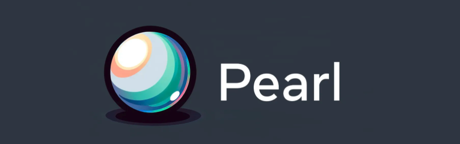
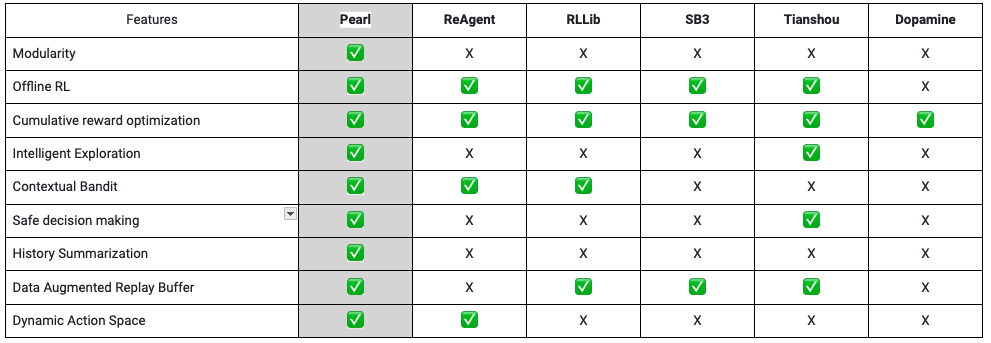

# Welcome to Pearl's official website!

Pearl is a production-ready reinforcement learning AI agent library. Pearl enables researchers and practitioners to develop Reinforcement Learning AI agents. These AI agents prioritize cumulative long-term feedback over immediate feedback and can adapt to environments with limited observability, sparse feedback, and high stochasticity. We hope that Pearl offers the community a means to build state-of-the-art Reinforcement Learning AI agents that can adapt to a wide range of complex production environments. 

## Pearl in a nut shell and installation guide
TO BE FILLED

## Why Pearl?
Prior to Pearl, Reinforcement Learning libraries focused on AI agents with a single objective: optimizing for cumulative reward. However, real-world applications require much more than this, particularly in systems that have the potential to cause repercussions (e.g. regress user sentiment, or surface an Ad that may be repetitive or have lower longer term value to the people causing user churn) and in environments where user feedback is limited. The capabilities include offline pre-training, intelligent exploration, safe decision making, history behavior summarization, data augmentation and dynamic action spaces. 

## Pearl Design

Pearl was built with a modular design so that industry practitioners or academic researchers can select any subset and flexibly combine features below to construct a Pearl agent customized for their specific use cases:
* Cumulative reward optimization: Pearl excels in this fundamental aspect of Reinforcement Learning, offering diverse optimization strategies suitable for various applications ranging from recommendation systems to robotics. 
* Offline pre-training: Utilizing offline data in decision making is critical for ensuring a positive long-term user experience without relying heavily on direct interactions with people (or the environment). Incorporating offline learning into an AI agent, enables us to create personalized AI systems with minimal environmental interactions. For example, we can predict the right sequence of recommendations for people given their past interactions with the system.
* Intelligent exploration: Pearl’s intelligent exploration module allows researchers and engineers to apply state-of-the-art exploration strategies for contextual bandit and other such Reinforcement Learning problems. These strategies can be used to help people efficiently discover new topics and preferences.
* Safe decision making: Production environments require AI agents to make decisions that minimize risks and avoid inadvertent repercussions. Pearl offers a risk and control module that enables decision-making while avoiding high-risk or undesired consequences. A Pearl agent equipped with the risk and control module can significantly reduce recommendations or actions that have a high probability of regressing user experience or advertiser outcomes. 
* History behavior summarization: Many industry and research problems involve people and environments that are only partially observable by the AI agent. Pearl incorporates a history summarization module that uses past observations to accurately estimate the user’s and environment’s current state. As people’s expectations of how their data is used continue to evolve, regulations and policies from governments and industry players are also changing. Evolving data use regulations and platform practices may change the type and amount of data available to machine learning models. Pearl enables informed decision making in these limited observability scenarios so we can provide better services to people while supporting their need for privacy. 
* Data augmentation: Data collected from agent interactions offer more insights by revealing the state and context of the underlying environment in which the users interact with Ads. Pearl’s data augmentation capabilities enable faster learning and generalization in complex environments.
* Dynamic action spaces: In many industry applications, AI agents are often offered different sets of available actions, e.g. in recommendation systems the most popular content or the most effective ads creatives change frequently in a matter of a few hours. Unlike existing Reinforcement Learning libraries, Pearl can adapt to a dynamic set of available actions at every decision-making step. 

## Comparison to Other Libraries
ReAgent, our previous generation of Reinforcement Learning library, garnered over 3,500 Github stars with more than 500 project forks. Building on Reagent’s success, Pearl offers a much richer feature set of advanced capabilities pushing the state of the art AI innovation in Reinforcement Learning. Below we compare Pearl with the key open source alternatives.

